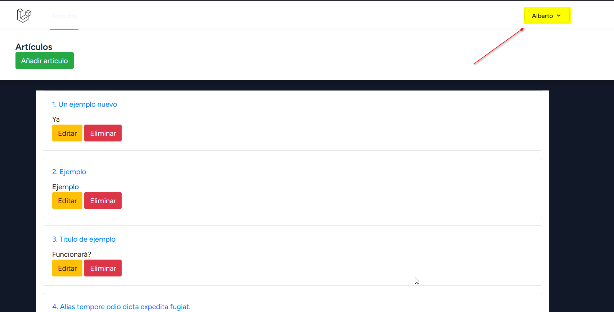
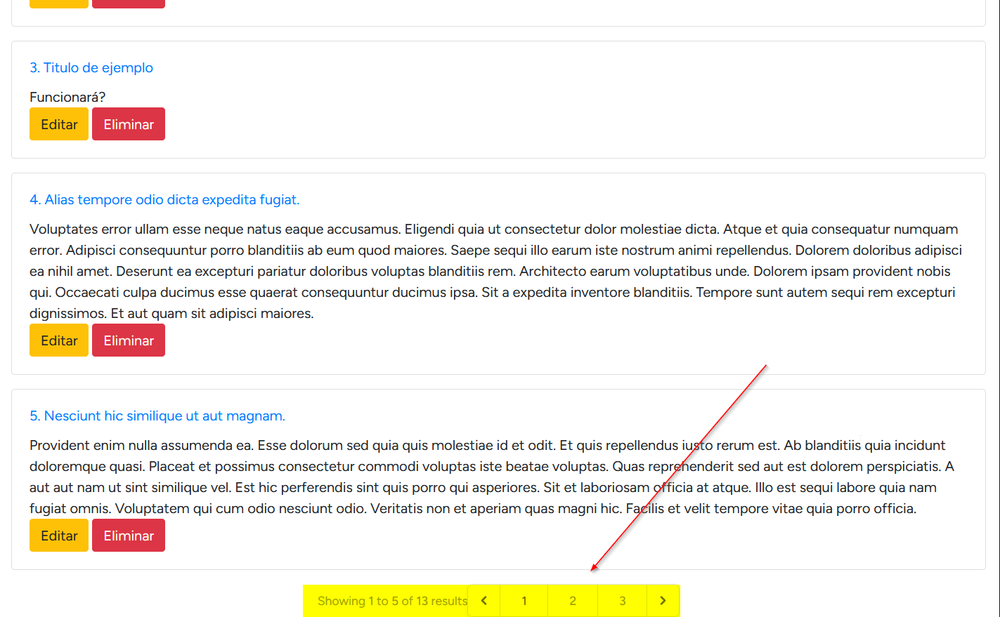

<p align="center"><a href="https://laravel.com" target="_blank"></a></p>

<p align="center">
<a href="https://github.com/laravel/framework/actions"></a>
<a href="https://packagist.org/packages/laravel/framework"></a>
<a href="https://packagist.org/packages/laravel/framework"></a>
<a href="https://packagist.org/packages/laravel/framework"></a>
</p>

## Proyecto de Laravel

Mi primer proyecto de Laravel donde se puede insertar y mostrar diferentes articulos. Puedes registrarte y loguearte para poder insertar articulos. Si quieres ya un usuario creado puedes usar el siguiente:

Usuario: a.morcillo@sapalomera.cat
Contraseña: P@ssw0rd

## Cosas en tener en cuenta

El perfil puede que no se vea de primera mano pero esta arriba a la derecha como puedes ver en la imagen marcado en amarillo:



La paginación le pasa lo mismo que en el perfil, que se ve poco:


## Base de datos
Ya esta la estructura creada en los archivos de migración. Hay datos ya creados usando el seeder. Para poder crear la base de datos y los datos necesitas ejecutar los siguientes comandos:

```bash 
php artisan migrate
php artisan db:seed
```


## Requesitos

Para que este proyecto funcione correctamente, necesitarás tener instalado:

- Laravel
- Vite para el desarrollo y la construcción de la aplicación.
- Dependencias de desarrollo como @tailwindcss/forms, alpinejs, autoprefixer, axios,  laravel-vite-plugin, postcss, tailwindcss, y vite.
- Dependencias como bootstrap.
  
## Versiones

Vite: ^5.0.0
@tailwindcss/forms: ^0.5.2
alpinejs: ^3.4.2
autoprefixer: ^10.4.2
axios: ^1.6.4
laravel-vite-plugin: ^1.0.0
postcss: ^8.4.31
tailwindcss: ^3.1.0
bootstrap: ^5.3.3


